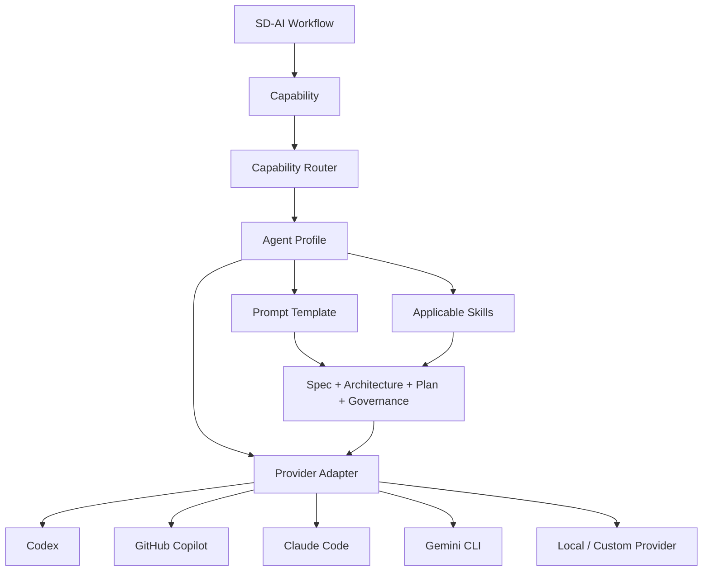

# SD-AI Agent Platform

SD-AI v0.2 adds a provider-neutral agent platform on top of the deterministic SDD lifecycle.



## Capabilities

Profiles may support `requirements`, `architecture`, `planning`, `coding`, `review`, `testing`, `security`, and `documentation`.

Workflows/users select a capability. Routing selects a profile. The profile selects a provider, prompt, model override, and skills.

## Profiles and routing

Profiles live in `.sdai/agents.yaml`; defaults live in `.sdai/routing.yaml`. Routing is only a default, and `--profile` can override it per invocation.

This keeps vendor selection out of the process control plane.

## Execution modes

`advisory` is the default and requests analysis or a patch plan without repository modification. `workspace-write` must be explicit:

```bash
sdai agents run coding FEATURE-123 --profile codex --mode workspace-write
```

Provider-specific permissions still apply. SD-AI never adds broad unrestricted permission flags automatically.

## Context

The runtime assembles bounded feature artifacts, project governance, the capability prompt, and only the skills applicable to that capability. The chat/session does not become the durable source of truth.
