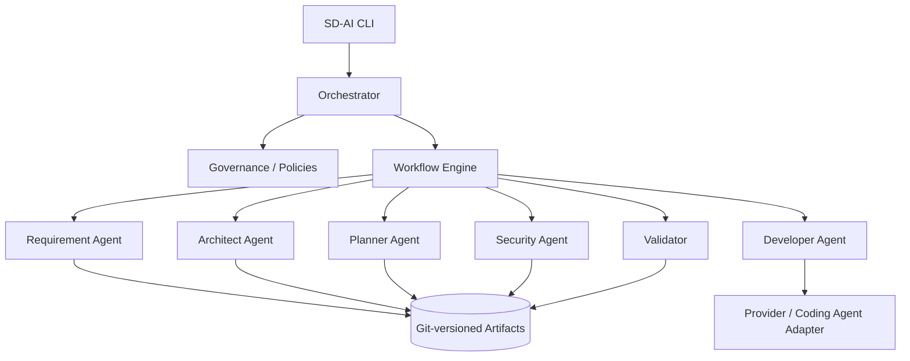

# SD-AI Framework Architecture

## Control-plane model

SD-AI is intentionally a **control framework**, not an LLM implementation.



## Source of truth

Prompts and conversations are ephemeral. The source of truth is the versioned feature workspace:

```text
specs/<feature>/
├── 00-intake.md
├── specification.md
├── architecture/
├── adr/
├── plan.md
├── tasks.yaml
├── implementation-brief.md
└── security-review.md
```

## Separation of duties

Agents should not silently cross boundaries. For example, a Developer Agent may propose an ADR but should not rewrite an approved architectural decision without review.

## Provider boundary

External model or coding-agent integrations implement a provider/adapter contract. This keeps orchestration, policy, artifact structure, and validation independent of model vendor.
