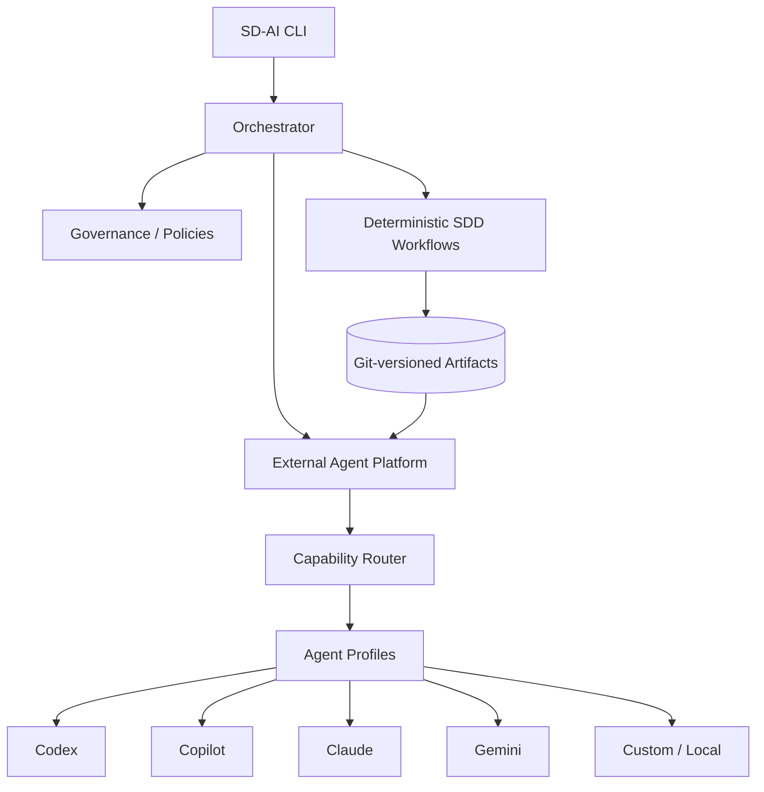

# SD-AI Framework Architecture

SD-AI is a **development control framework**, not an LLM implementation.



## Two planes

The **SDD control plane** creates and validates durable source-of-truth artifacts:

```text
Requirement → Specification → Architecture/ADR → Plan/Tasks → Validation
```

The **AI execution plane** uses interchangeable agents:

```text
Capability → Route → Agent Profile → Prompt + Skills + Context → Provider Adapter
```

The execution plane can change vendors without changing the feature specification or architecture governance model.

## Source of truth

Durable state lives under `specs/<feature>/`; prompts and conversations are execution context, not the source of truth.

## Extension boundaries

- providers: built-in CLI adapters plus Python entry-point plugins
- skills: project-local provider-neutral instruction packages
- prompts: project-local Markdown templates
- workflows: declarative lifecycle definitions
- integrations: future GitHub, Jira, quality, security, and deployment adapters
